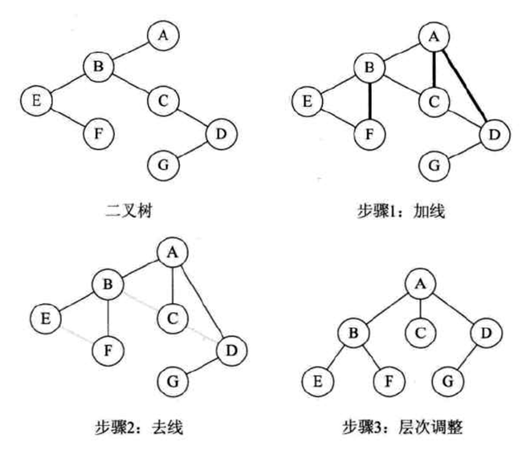

# 二叉排序树
即搜索树，排序树  
>定义  
>1. 空树  
>2. 
>>1) 若左子树不为空，则左子树上的所有节点的关键字值都比根节点关键字值小。  
>>2）右子树不为空，则右子树上的所有节点的关键字值都比根节点关键字值大。  
>>3)左右子树都为二叉树。  
>>4)没有重复值（实际使用可忽略）

代码实现：查看SearchBinaryTree

## 树，森林，二叉树的转换
### 1. 树转换成二叉树
1）加线。在所有兄弟节点之间加一条连线。  
2）去线。对树中每个节点，只保留它与第一个孩子节点的连线，删除它与其它孩子节点之间的连线。   
3）层析调整。以树的根节点为轴心，将整棵树顺时针旋转一定的角度，使之结构层次分明。注意第一个孩子时二叉树节点的左孩子，兄弟换过来成为孩子节点时是右孩子。

### 2.森林转换成二叉树
1）将每个数转换成二叉树  
2）第一棵树不动，从第二棵二叉树开始，依次把后一棵二叉树的根节点作为前一棵二叉树的根节点的右孩子，用线连接。

### 3.二叉树转换成树
1）将每个节点的左孩子的n个右孩子节点作为此节点的孩子。将该节点与这些右孩子节点用线连起来。  
2）删除原二叉树中所有节点与其右孩子节点的连线。  
3）层次调整  

### 4.二叉树转换为森林
1）从根节点开始，若存在右孩子就将其连线删除。再查看分离后的二叉树，有右孩子就删除连线。  
2）将所有的二叉树转换成树。  

***
## 注意：二叉树是能转换成森林还是树需要通过判断。判断条件：看这棵二叉树的根节点有没有右孩子，有就是森林，没有就是树。